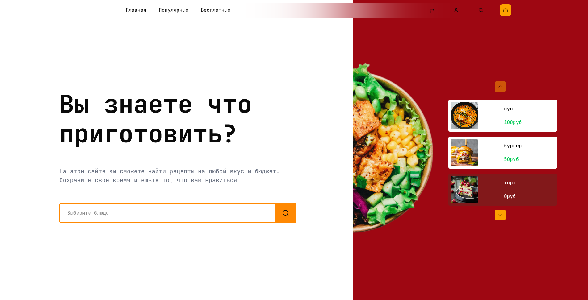
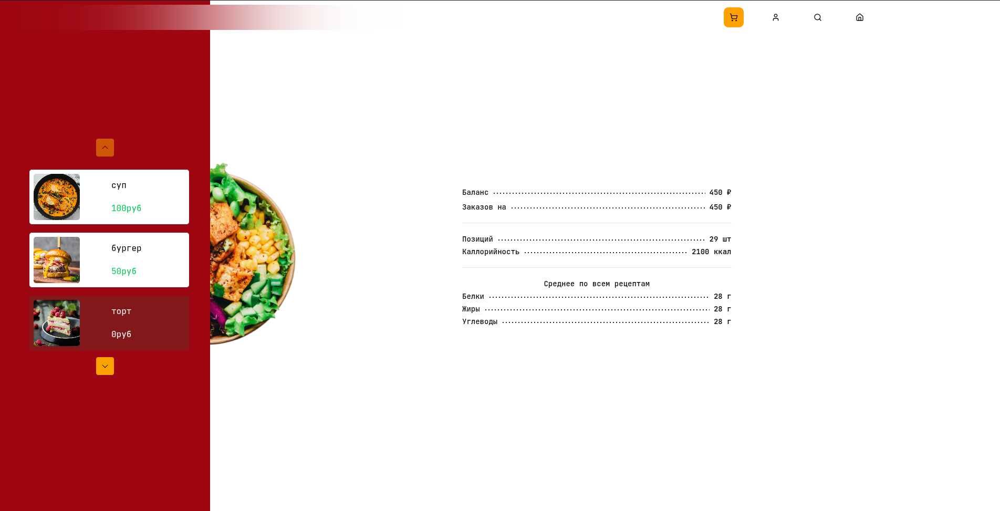
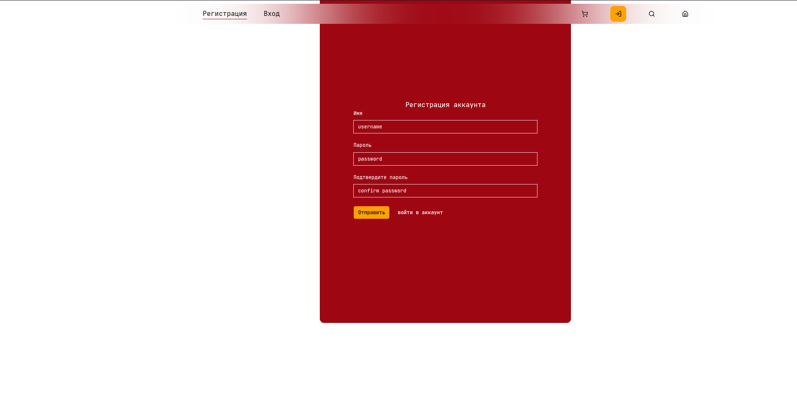
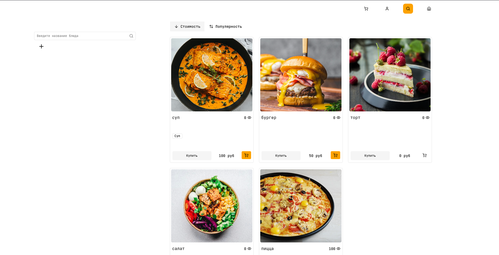
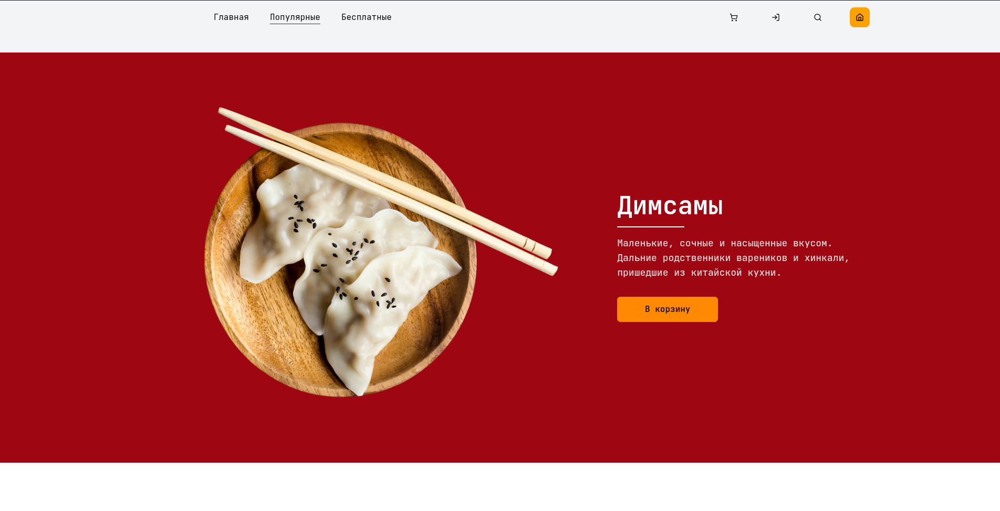
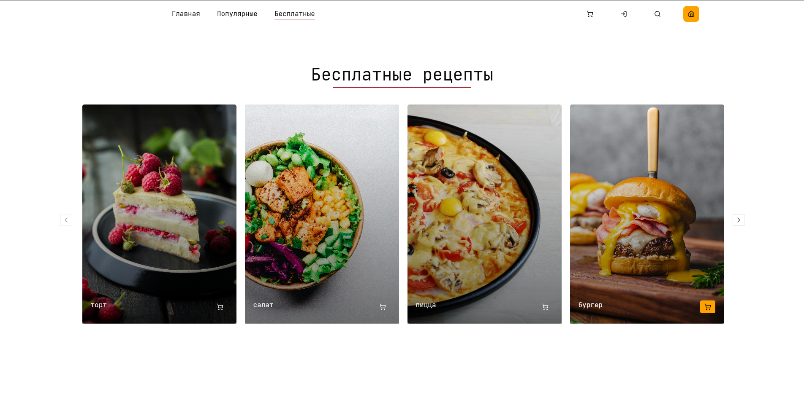

# Cooking — Магазин рецептов

**Современное fullstack-приложение для поиска, хранения и управления рецептами.**


## О проекте

**Cooking** — это удобный «магазин рецептов», где пользователи могут искать блюда по ингредиентам и тегам, сохранять любимые рецепты и получать умные рекомендации.

Приложение реализовано как **веб-сайт + Android-приложение** (через Capacitor) с единой кодовой базой на фронтенде.

### Основные возможности

-  **Умный полнотекстовый поиск** по названию, ингредиентам и тегам (PostgreSQL + trigram индексы)
-  Гибкая система тегов и фильтров
-  Авторизация через сессии (хранятся в Redis)
-  Сохранение любимых рецептов
-  **PWA + нативное Android-приложение** на базе Capacitor
-  Современный чистый дизайн (собственный дизайн-система в Lunacy + shadcn/ui)

## Архитектура и технологии

### Backend

- **FastAPI** (Python 3.11+)
- **DDD (Domain-Driven Design)** — чистая архитектура, разделение на домены, application и infrastructure
- **FastAdmin** — удобная административная панель
- **PostgreSQL** + **pg_trgm** расширение для умного поиска
- **Redis** — кэширование сессий и часто используемых данных
- Асинхронный стек (async/await)

### Frontend

- **React** + TypeScript
- **shadcn/ui** + **Tailwind CSS**
- Собственная дизайн-система, созданная в **Lunacy**
- Capacitor — для сборки нативного Android-приложения

### Общее

- Единая авторизация между веб и мобильной версией
- REST API с четкой структурой и документацией (OpenAPI)
- Адаптивный интерфейс (мобильный-first)

## Скриншоты








## Как запустить проект локально

### Требования
- Docker (рекомендуется)
- Node.js 20+
- Python 3.11+
- PostgreSQL + Redis (или через Docker Compose)

### Запуск

```bash
# Клонирование
git clone https://github.com/Arseniy-B/Cooking
cd cooking

# Запуск backend
cd backend
source .venv/bin/activate
uvicorn src.main:app --reload

# Запуск frontend
cd ../frontend
npm install
npm run dev
